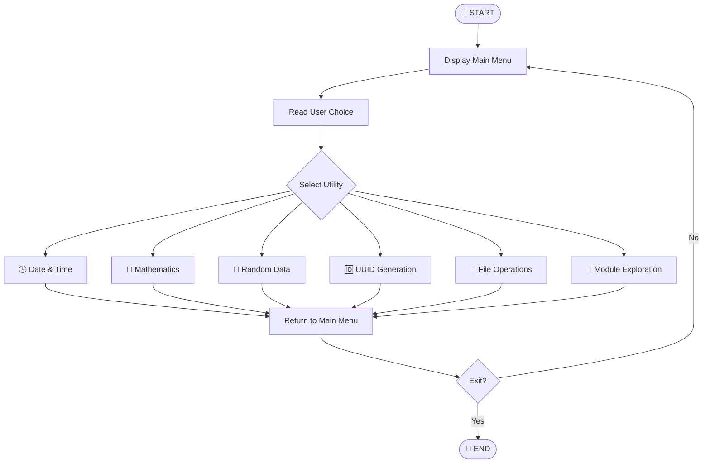

 <div align="center">

# 🧰 Modular & Package Multi-Utility Toolkit

### 🐍 A Python Console Application for Everyday Utilities

**One Toolkit · Multiple Utilities · Modular Python Programming**

<p>
  
  
  
  
</p>

*Date & Time · Mathematics · Random Data · UUID · File Handling · Module Exploration*

</div>

---

## 📌 Project Information

| 🏷️ Item                | 📝 Details                      |
| ----------------------- | ------------------------------- |
| 📛 Project Name         | Multi-Utility Toolkit           |
| 🐍 Programming Language | Python                          |
| ⚙️ Python Version       | 3.14.6                          |
| 💻 Project Type         | Menu-Driven Console Application |
| 👩‍💻 Author            | Krisha Savaliya                 |
| 📄 Main File            | `Modular_Packager.py`           |
| 📦 Custom Package       | `custom_modules`                |

## 📖 About the Project

**Multi-Utility Toolkit** is a Python-based console application that brings multiple everyday utilities together in one program.

It combines date and time operations, mathematical calculations, random data generation, UUID generation, file handling, and Python module exploration.

The project demonstrates how to organize Python code using **functions, custom modules, and packages** while practicing exception handling and input validation.

## 🎯 Project Objectives

* 🐍 Practice Python programming fundamentals.
* 📦 Organize code using functions, modules, and packages.
* 🧮 Perform mathematical calculations.
* 🕒 Work with dates and times.
* 🎲 Generate random values and OTPs.
* 🆔 Generate unique UUID identifiers.
* 📂 Perform basic file operations.
* 🛡️ Practice exception handling and input validation.
* 💻 Build a menu-driven console application.

## ✨ Key Features

### 🕒 1. Date and Time Operations

* Display the current date and time.
* Calculate the difference between two dates.
* Format dates using custom formats.
* Run a stopwatch.
* Run a countdown timer.

### ➗ 2. Mathematical Operations

* Calculate factorials.
* Calculate compound interest.
* Perform trigonometric calculations.
* Calculate circle area.
* Calculate rectangle area.
* Calculate triangle area.

### 🎲 3. Random Data Generation

* Generate random numbers.
* Generate random lists.
* Generate random passwords.
* Generate random OTPs.
* Perform random sampling.

### 🆔 4. UUID Generation

Generate UUID version 4 identifiers for unique identification.

### 📂 5. File Operations

Perform basic file operations through custom Python modules:

* Create files.
* Write file contents.
* Read file contents.
* Append new data.

### 🔎 6. Python Module Exploration

Explore importable Python modules and their attributes using `importlib` and `dir()`.

## 🧠 Python Concepts Covered

| Concept                   | Description                   |
| ------------------------- | ----------------------------- |
| 🔧 Functions              | Reusable blocks of code       |
| 📦 Modules & Packages     | Organizing Python programs    |
| 🔁 Loops                  | Repeating operations          |
| 🔀 Conditional Statements | Menu and decision logic       |
| 🛡️ Exception Handling    | Handling common errors        |
| 📂 File Handling          | Reading and writing files     |
| 🕒 Date & Time            | Working with dates and timers |
| 🧮 Mathematics            | Calculations and formulas     |
| 🎲 Random Module          | Generating random data        |
| 🆔 UUID                   | Generating unique identifiers |
| 🔎 Dynamic Imports        | Exploring Python modules      |
| ✅ Input Validation        | Checking user input           |

## 📚 Python Modules Used

| Module           | Purpose                             |
| ---------------- | ----------------------------------- |
| `datetime`       | Date and time operations            |
| `time`           | Stopwatch and countdown             |
| `math`           | Mathematical calculations           |
| `random`         | Random values and sampling          |
| `uuid`           | UUID generation                     |
| `importlib`      | Dynamic module imports              |
| `os` *(if used)* | Operating system and file utilities |

> **Note:** The described functionality uses Python's standard library and custom project modules. No third-party packages are required.

## 📁 Project Structure

```text
Multi-Utility-Toolkit/
│
├── Modular_Packager.py
│
├── custom_modules/
│   ├── __init__.py
│   ├── file_operations.py
│   └── math_operations.py
│
├── README.md
├── output.png
└── vedas.txt
```

### 📄 File Descriptions

| File / Folder         | Description                   |
| --------------------- | ----------------------------- |
| `Modular_Packager.py` | Main application              |
| `custom_modules/`     | Custom Python package         |
| `__init__.py`         | Package initialization        |
| `file_operations.py`  | File operation functions      |
| `math_operations.py`  | Mathematical functions        |
| `README.md`           | Project documentation         |
| `output.png`          | Application output screenshot |
| `vedas.txt`           | Text file used by the project |

## ⚙️ Requirements

* 🐍 Python 3.14.6
* 💻 Terminal or command prompt
* 📝 Python-compatible editor (optional)
* 📂 Complete project source files
* 📦 Custom modules package

## 🚀 Installation and Setup

### 1️⃣ Clone the Repository

Replace `YOUR-USERNAME/YOUR-REPOSITORY` with your actual GitHub repository details.

```bash
git clone https://github.com/YOUR-USERNAME/YOUR-REPOSITORY.git
```

### 2️⃣ Open the Project Directory

```bash
cd Multi-Utility-Toolkit
```

### 3️⃣ Check Python Version

```bash
python --version
```

Expected version:

```text
Python 3.14.6
```

### 4️⃣ Run the Application

```bash
python Modular_Packager.py
```

### 5️⃣ Select a Menu Option

Enter the number corresponding to your preferred utility and follow the terminal prompts.

## 🧩 Custom Module Reference

### 📂 `custom_modules/file_operations.py`

| Function        | Operation           |
| --------------- | ------------------- |
| `create_file()` | Create a file       |
| `write_file()`  | Write file contents |
| `read_file()`   | Read file contents  |
| `append_file()` | Append data         |

### 🧮 `custom_modules/math_operations.py`

| Function              | Operation                          |
| --------------------- | ---------------------------------- |
| `factorial()`         | Calculate factorial                |
| `compound_interest()` | Calculate compound interest        |
| `trigonometry()`      | Perform trigonometric calculations |
| `circle_area()`       | Calculate circle area              |
| `rectangle_area()`    | Calculate rectangle area           |
| `triangle_area()`     | Calculate triangle area            |

*Ensure these function names match the actual definitions in your source files.*

## 🛡️ Input Validation and Error Handling

The application is designed to account for common situations such as:

* ❌ Invalid date input.
* 🔢 Invalid numeric input.
* ➖ Negative factorial values.
* 📐 Invalid geometric dimensions.
* 📄 Existing files.
* 🔍 Missing files.
* ⚠️ File system errors.
* 📦 Missing Python modules.
* 🚫 Invalid menu selections.

*Actual error handling depends on the implementation in the Python source files.*

## 🔄 Program Workflow



## 🖥️ Sample Main Menu

```text
==================================================
       🧰 MULTI-UTILITY TOOLKIT 🧰
==================================================

       Welcome to Multi-Utility Toolkit!

Choose an option:

  1. 🕒 Date and Time Operations
  2. 🧮 Mathematical Operations
  3. 🎲 Random Data Generation
  4. 🆔 Generate Unique Identifiers (UUID)
  5. 📂 File Operations (Custom Module)
  6. 🔎 Explore Module Attributes (dir())
  7. 🚪 Exit

--------------------------------------------------
Enter your choice:
```

## 🔮 Future Improvements

* 🎨 Develop a graphical user interface (GUI).
* 🧪 Add automated unit testing.
* ➕ Introduce more utility features.
* 🛡️ Improve input validation.
* 🔐 Use secure random generation where appropriate.
* 📜 Add operation history.
* 🧮 Include additional mathematical functions.
* 📊 Add logging and error reporting.

## 🎓 Learning Outcomes

By developing this project, you can practice:

* Python programming fundamentals.
* Modular programming and package organization.
* File handling and exception handling.
* Mathematical programming.
* Random data generation and UUIDs.
* Standard-library module exploration.
* Console application development.

▶️ How to Run
Open the Multi-Utility-Toolkit folder in VS Code.
Open the terminal in that folder.
Run this command:
python Modular_Packager.py
Choose an option by entering its number.
Follow the prompts shown in the terminal.
Choose 7. Exit from the main menu to close the program.

🖥️ Sample Output
🏠 Main Menu
==================================================
       🧰 Welcome to Multi-Utility Toolkit 🧰
==================================================

Choose an option:

1. Datetime and Time Operations
2. Mathematical Operations
3. Random Data Generation
4. Generate Unique Identifiers (UUID)
5. File Operations (Custom Module)
6. Explore Module Attributes (dir())
7. Exit

Enter your choice:
🕒 1. Date and Time Operations
--- Datetime and Time Operations ---

1. Display current date and time
2. Calculate difference between two dates
3. Format date into custom format
4. Stopwatch
5. Countdown Timer
6. Back to Main Menu

Enter your choice: 1

Current Date and Time: 2026-10-07 16:12:19
📅 Calculate Difference Between Dates
Enter your choice: 2

Enter the first date (YYYY-MM-DD): 2007-04-15
Enter the second date (YYYY-MM-DD): 2006-12-19

Difference: 117 days
🧮 2. Mathematical Operations
--- Mathematical Operations ---

1. Calculate Factorial
2. Calculate Compound Interest
3. Trigonometric Calculations
4. Area of Geometric Shapes
5. Back to Main Menu

Enter your choice: 1

Enter a number: 5
Factorial: 120
💰 Compound Interest
Enter your choice: 2

Enter principal amount: 1000
Enter rate of interest (in %): 5
Enter time (in years): 2

Compound Interest: 102.50
🎲 3. Random Data Generation
--- Random Data Generation ---

1. Generate Random Number
2. Generate Random List
3. Create Random Password
4. Generate Random OTP
5. Random Sampling
6. Back to Main Menu

Enter your choice: 3

Enter password length: 8
Generated Password: 8DZLXAkW
🆔 4. UUID Generation
--- Generate Unique Identifiers (UUID) ---

Generated UUID: b5b4fe26-6d50-435c-8978-a44e8f10ec66

The UUID and random values will differ each time you run the program.

📂 5. File Operations
--- File Operations (Custom Module) ---

1. Create a new file
2. Write to a file
3. Read from a file
4. Append to a file
5. Back to Main Menu

Enter your choice: 1

Enter file name: example.txt
File created successfully!
✍️ Write Data to a File
Enter your choice: 2

Enter file name: example.txt
Enter data to write: This is a sample file.

Data written successfully!
📖 Read File Contents
Enter your choice: 3

Enter file name: example.txt

File Content:
This is a sample file.
🔎 6. Explore Python Module Attributes
--- Explore Module Attributes (dir()) ---

Enter module name to explore: math

Available Attributes in math:
['__doc__', '__loader__', '__name__', '__package__',
 '__spec__', 'acos', 'acosh', 'asin', 'asinh',
 'atan', 'atan2', 'ceil', 'comb', 'cos', 'degrees',
 'exp', 'factorial', 'floor', 'gcd', 'hypot', 'pi',
 'pow', 'radians', 'sin', 'sqrt', 'tan', 'trunc']

The complete attribute list depends on your Python version.

🚪 7. Exit Application
Enter your choice: 7


## 📌 Summary

**Multi-Utility Toolkit** is a beginner-friendly Python project that combines useful everyday operations into a single menu-driven application.

It demonstrates practical applications of Python's standard library, custom packages, reusable functions, and modular code organization.

---

<div align="center">

### 💖 Developed with Python 🐍

**Created by Krisha Savaliya**

*Learning · Building · Improving 🚀*

</div>
